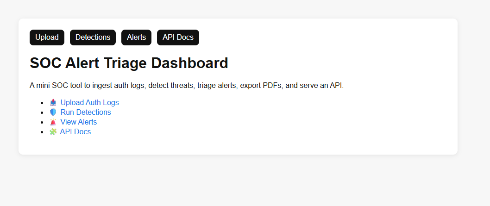
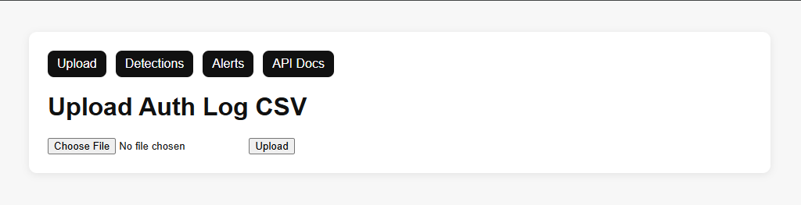
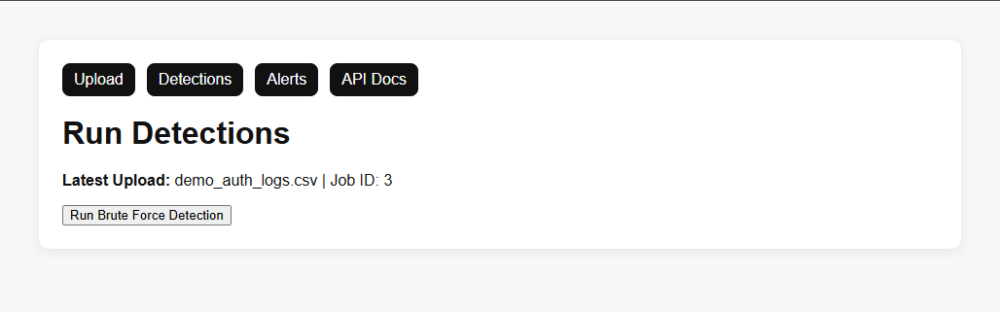
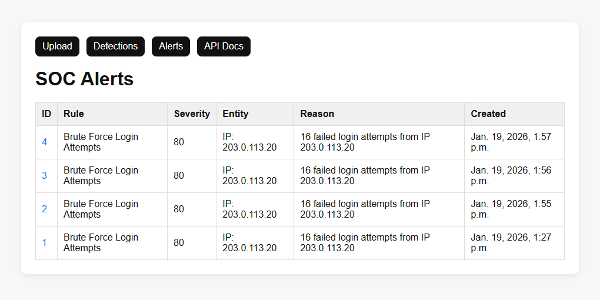
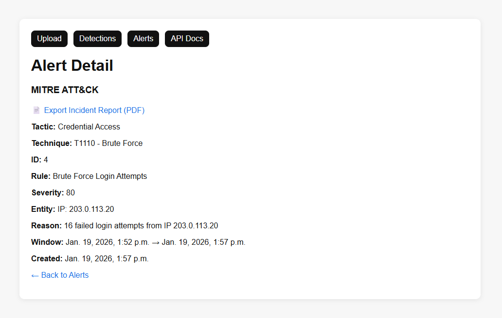
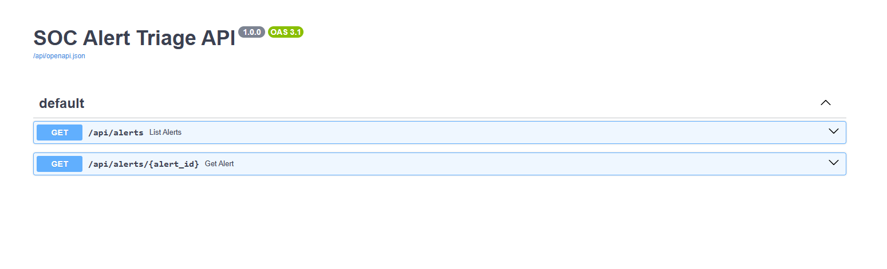

# SOC Alert Triage Dashboard (Django)

A mini SOC-style web application that ingests authentication logs, detects suspicious activity, generates triage-ready alerts enriched with MITRE ATT&CK mapping, exports incident reports as PDF, and exposes a REST API with interactive Swagger docs.

---

## 🚀 Features
- Upload authentication log CSV → store events in database
- Run detections (currently implemented: **Brute Force Login Attempts**)
- Alerts list + alert detail pages for triage workflow
- MITRE ATT&CK enrichment (**Credential Access / T1110 Brute Force**)
- Export alert as **PDF Incident Report**
- REST API endpoints using **Django Ninja** + Swagger docs (`/api/docs`)

---

## 🖼️ Screenshots

### Home


### Upload Logs


### Run Detections


### Alerts List


### Alert Detail + MITRE


### API Docs


---

## 🛠️ Tech Stack
- **Backend:** Django (Python)
- **Database:** SQLite
- **API:** Django Ninja (Swagger docs)
- **Reporting:** ReportLab (PDF export)
- **Frontend:** HTML + CSS

---

```md
## ▶️ Run Locally

### 1) Create virtual environment
```bash
python -m venv .venv
2) Activate environment
Windows

bash
Copy code
.venv\Scripts\activate
Mac/Linux

bash
Copy code
source .venv/bin/activate
3) Install dependencies
bash
Copy code
pip install -r requirements.txt
4) Run migrations
bash
Copy code
python manage.py migrate
5) Start the server
bash
Copy code
python manage.py runserver
Open:

Home: http://127.0.0.1:8000/

API Docs: http://127.0.0.1:8000/api/docs

Add analytics dashboard (top IPs/users, trends over time)
